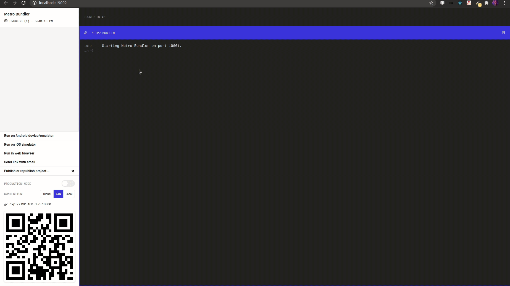

<!-- title -->
<h1 align="center">
  😊 Happy
</h1>

<!-- description -->
<h2 align="center">
  Bring happiness to the world. <br>
  Visit orphanages and change many children's day.
</h2>

---

<!-- banner -->
<h1 align="center">
  
</h1>

<!-- status -->
<p align="center"><b>Status: Finished ✅</b></p>

<!-- badges -->
<p align="center">
  
  
  <a href="https://www.linkedin.com/in/hbalardin/">
    
  </a>
  
  
</p>

---

<!-- index -->
<p align="center">
  <a href="#-about">About</a> •
  <a href="#-features">Features</a> •
  <a href="#-technologies">Technologies</a> •
  <a href="#-running-the-project">Running the project</a> •
  <a href="#-license">License</a> •
  <a href="#-readme-versions">README Versions</a>
</p>

---

## 📄 About

The purpose of **Happy** is to make visits to orphanages more accessible, providing a unique experience for both the visitor and children.

This project was developed during third edition of **NLW (Next Level Week)**. 

The **NLW** is a one week online event, provided by **RocketSeat**, focused on getting our hands dirty. The content is only available during the event.

---

## 🔝 Features

- Register orphanages.
- List orphanages on the map.
- Create route from your location to an orphanage via Google Maps.

<!-- gifs -->
<p align="center">
  
</p>

---

## 🔨 Technologies

These are the main technologies used in the construction of the project:

- [Typescript](https://www.typescriptlang.org/)
- [Node.js](https://nodejs.org/en/)
- [ReactJS](https://reactjs.org/)
- [React Native](https://reactnative.dev/)
- [Expo](https://expo.io/)

---

## 🚀 Running the project

First of all, you need to have [Git](https://git-scm.com), [Yarn](https://yarnpkg.com/) and [Node.js](https://nodejs.org/en/) installed on your machine. After that, you can proceed.

### 📂 Installing the dependencies

```bash
# Clone this repository:
$ git clone https://github.com/hbalardin/nlw-03-happy

# Access the project folder:
cd nlw-03-happy

# Go to the backend folder:
cd backend

# Install the dependencies:
yarn

# Go to the web folder:
cd ../web

# Install the dependencies:
yarn

# Go to the mobile folder:
cd ../mobile

# Install the dependencies:
yarn

# Back to the project folder:
cd ..
```

---

### 💾 Running the server (back-end)

For the web and mobile applications to work correctly, the backend must be running.

```bash
# Go to the server folder:
cd server

# Run the server in development mode:
yarn dev
```

---

### 💻 Runnig the web application (front-end)

With the server running, open a new terminal and go to the project folder.

```bash
# Go to the web folder:
cd web

# Run the site in development mode:
yarn start
```
If the page does not open automatically, access: http://localhost:3000

---

### 📱 Running the app (mobile)

1. Install the ** expo ** app on your smartphone ([IOS](https://apps.apple.com/br/app/expo-client/id982107779) or [Android](https://play.google.com/store/apps/details?id=host.exp.exponent&hl=pt_BR)).
2. Run the application:

```bash
# Go to the mobile folder:
cd mobile

# Run the application in development mode:
yarn start

# If the expo page does not open automatically, access: http://localhost:3000
``` 

3. Open the **expo** app in your smartphone and scan the QR Code on expo page.

PS: For the mobile app to work correctly, you need to [configure the project with your machine IP](-setting-ip). 

---

#### ⚙️ Setting IP

<p align="center">
  
</p>

As in the gif above, replace **"localhost"** with **your machine's IP address** in these files:

1. mobile -> src -> config -> ip.ts
2. server -> src -> config -> ip.ts

---

## 📋 License

This project is under the license [MIT](https://github.com/hbalardin/nlw-03-happy/blob/master/LICENSE.md).

---

## 🚀 Get in touch!

Developed by [Henrique Balardin](https://www.linkedin.com/in/hbalardin).

---

## 🚩 README Versions

- [English](https://github.com/hbalardin/nlw-03-happy/blob/master/README-en.md) | [Portuguese](https://github.com/hbalardin/nlw-03-happy/blob/master/README.md)
