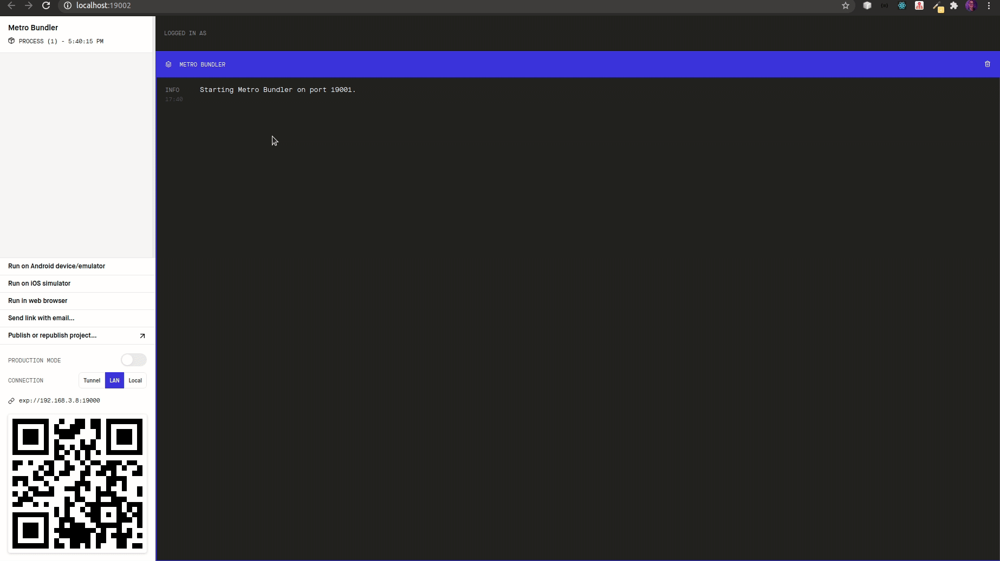

<!-- título -->
<h1 align="center">
  😊 Happy
</h1>

<!-- descrição -->
<h2 align="center">
  Leve felicidade para o mundo. <br>
  Visite orfanatos e mude o dia de muitas crianças.
</h2>

---

<!-- banner -->
<h1 align="center">
  
</h1>

<!-- status -->
<p align="center"><b>Status: Concluído ✅</b></p>

<!-- badges -->
<p align="center">
  
  
  <a href="https://www.linkedin.com/in/hbalardin/">
    
  </a>
  
  
</p>

---

<!-- index -->
<p align="center">
  <a href="#-sobre">Sobre</a> •
  <a href="#-funcionalidades">Funcionalidades</a> •
  <a href="#-tecnologias">Tecnologias</a> •
  <a href="#-executando-o-projeto">Executando o projeto</a> •
  <a href="#-licença">Licença</a> •
  <a href="#-versões-do-readme">Versões do README</a>
</p>

---

## 📄 Sobre

O objetivo do **Happy** é tornar as visitas a orfanatos mais acessíveis, proporcionando uma experiência única, tanto para o visitante tanto para as crianças.

Este projeto foi desenvolvido durante a terceira edição da **NLW (Next Level Week)**. 

A **NLW** é um evento online de uma semana, disponibilizado pela **RocketSeat**, focado em por a mão na massa. O conteúdo fica disponível apenas durante o evento.

---

## 🔝 Funcionalidades

- Cadastrar orfanatos.
- Listar orfanatos no mapa.
- Criar rota do seu local até um orfanato via Google Maps.

<!-- gifs -->
<p align="center">
  
</p>

---

## 🔨 Tecnologias

Estas são as principais tecnologias utilizadas na construção do projeto:

- [Typescript](https://www.typescriptlang.org/)
- [Node.js](https://nodejs.org/en/)
- [ReactJS](https://reactjs.org/)
- [React Native](https://reactnative.dev/)
- [Expo](https://expo.io/)

---

## 🚀 Executando o projeto

Antes de qualquer coisa, você precisa ter  o [Git](https://git-scm.com), o [Yarn](https://yarnpkg.com/) e o [Node.js](https://nodejs.org/en/) instalado na sua máquina. Feito isso, você pode prosseguir.

### 📂 Instalando dependências

```bash
# Clone este repositório:
$ git clone https://github.com/hbalardin/nlw-03-happy

# Acesse à pasta do projeto:
cd nlw-03-happy

# Vá à pasta backend:
cd backend

# Instale as depêndencias:
yarn

# Vá à pasta web:
cd ../web

# Instale as depêndencias:
yarn

# Vá à pasta mobile:
cd ../mobile

# Instale as depêndencias:
yarn

# Volte à pasta do projeto:
cd ..
```

---

### 💾 Rodando o servidor (back-end)

Para que as aplicação web e mobile funcionem corretamentem, o back-end precisa estar rodando.

```bash
# Vá à pasta backend:
cd backend

# Execute o backend em modo de desenvolvimento:
yarn dev
```

---

### 💻 Rodando a aplicação web (front-end)

Com o servidor rodando, abra um novo terminal e entre na pasta do projeto.

```bash
# Vá à pasta web:
cd web

# Execute o site em modo de desenvolvimento:
yarn start
```
Caso a página não abrir automaticamente, acesse: http://localhost:3000

---

### 📱 Rodando o aplicativo (mobile)

1. Instale o aplicativo **expo** em seu smartphone ([IOS](https://apps.apple.com/br/app/expo-client/id982107779) ou [Android](https://play.google.com/store/apps/details?id=host.exp.exponent&hl=pt_BR)).
2. Execute a aplicação:

```bash
# Vá à pasta mobile:
cd mobile

# Execute o aplicativo em modo de desenvolvimento:
yarn start

# Caso a página do expo não abrir automaticamente, acesse: http://localhost:19002
```

3. Abra o aplicativo **expo** em seu smartphone e escaneie o código QR da página do expo.

- PS: Para o aplicativo funcionar, é preciso [configurar o projeto com o IP da sua máquina](#-configurando-ip).

---

#### ⚙️ Configurando IP

<p align="center">
  
</p>

Como no gif acima, substitua o **"localhost"** pelo **endereço IP da sua máquina** nestes arquivos:

1. mobile -> src -> config -> ip.ts
2. server -> src -> config -> ip.ts

---

## 📋 Licença

Esse repositório está sob a licença [MIT](https://github.com/hbalardin/nlw-03-happy/blob/master/LICENSE.md).

---

## 🚀 Entre em contato!
Desenvolvido por [Henrique Balardin](https://www.linkedin.com/in/hbalardin).

---

## 🚩 Versões do README

- [Português 🇧🇷](https://github.com/hbalardin/nlw-03-happy/blob/master/README.md) | [Inglês 🇺🇸](https://github.com/hbalardin/nlw-03-happy/blob/master/README-en.md)
